Post-MVP Updated Design
====================

Primary Authors
---------------------

+ **Everyone:** data model, user interface
+ **Jon:** key concepts, feature descriptions, tasks
+ **Michelle:** security concerns, stakeholders
+ **Tyler:** purpose and goals, design challenges
+ **Rebecca:** context diagram, resources, risks, MVP, wireframes, workflow

Changes from Preliminary Design
--------------------------------------------
+ Major changes to:
	+ Data Model
	+ Feature Descriptions (added “Create Custom Time Ranges, Day Ranges, and Locations”)
	+ User Interface
	+ Design Challenges
+ Minor changes to:
	+ Overview
	+ Key Concepts

Overview
------------

### Purpose and Goals:

#### System To Be Built - Fireplace
> Fireplace is a simple todo list app with powerful and useful filtering functionality that hides tasks that are not relevant to the user in their current context (time, date, location). Upon creating a task, the user is asked to provide a small amount of metadata (time, date, and/or location) that the app can then use to determine in which contexts the task should be shown. The app performs its filtering automatically without the user needing to input any information at the time of viewing; the user is given the ability to disable filtering by clicking “See All Today’s Tasks” and “See All This Week’s Task” buttons. The user can also create Tags to name and package common sets of metadata, simplifying the process of applying this metadata upon task creation, so that the user can easily and quickly create tasks, even on a mobile device. 

#### Key Goals And Purpose
> Purpose
+ The issue with displaying all of a user’s tasks at once that many of these tasks are irrelevant to the user in their current context (e.g. most users do not wish to see work tasks when they are relaxing at home at the end of the day). A user becomes less efficient when they are shown a long list of tasks, because of the time it takes for them to scan the list and the overwhelming nature of the list. Limiting the number of tasks displayed to a user, without hiding anything important from them will often improve their efficiency and reduce their stress.
> Goals
+ Fireplace will have enough functionality to perform as a user’s primary to-do list.
+ Fireplace will improve upon existing to-do lists by reducing the amount of information shown to the user at any given time.
+ Adding tasks to fireplace will be quick and simple.
+ Fireplace will not hide important information from the user.
+ Fireplace’s UI will be compatible with standard screens and mobile screens.
	+ Fireplace will achieve a simple, intuitive, and comfortable user experience.

#### Motivation For Development
> Fireplace is not trying to revolutionize or shift the current todo list paradigm. A large portion of its interface and behavior mimics traditional todo lists, so as to provide a familiar and usable interface to the user. It is different in that it will not only automatically filter tasks based on the user’s current context, but this filtering will require far less user input than many todo lists currently on the market.   

### Context Diagram:

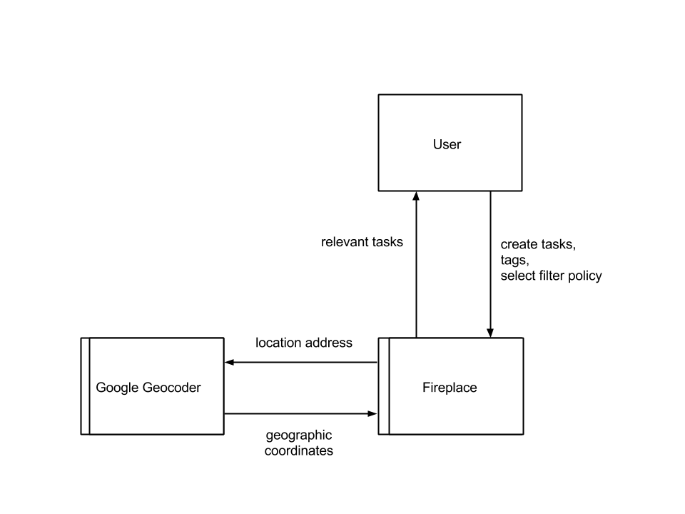

Concepts
------------

### Key Concepts

+ **Task:** A piece of work that the user wishes to complete.
+ **Metadatum:** A datum associated with a task that allows the app to filter tasks. Three categories of metadata: times, days, and locations. Also includes boolean attributes for marking tasks as important and/or long-lasting.
+ **Tag:** Commonly used metadata that are grouped together and given a name.
+ **Filtering policy:** A set of rules governing which tasks to show based on a time, date, and location.

### Data Model

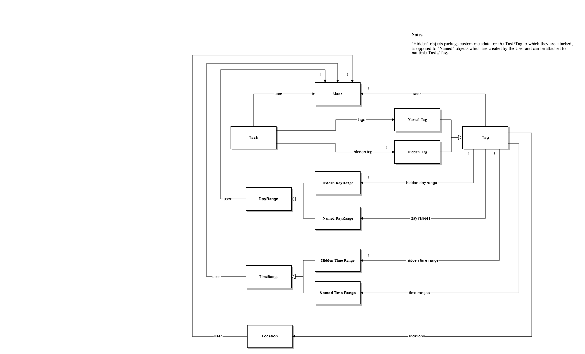

Behavior
-----------

### Feature Descriptions

+ **Managing Tasks:** Users can create tasks, as well as view/edit/delete Tasks that they created. Users can neither share Tasks with other Users nor interact with other Users’ Tasks. A Task is represented by a short, single line descriptor (title) and a longer plain text summary (content). The User can attach Tags to a Task or specify the Task metadata through a simple form.

+ **Create Custom Time Ranges, Day Ranges, and Locations:** Users can create named Time Ranges (e.g. “Evening => 7pm - 12pm”), named Day Ranges (e.g. “Weekends => Saturday, Sunday”), and named Locations (ex. “Dorm Room => 450 Memorial Drive, Cambridge, MA 01239”) to add to Tasks and Tags.

+ **Create Tags:** Users can create tags to simplify adding the same metadata to multiple tasks. Tags can either include named Time Ranges and named Day Ranges or include custom Time Ranges and custom Day Ranges. Tags can also include named Locations. Tags are private to the User that created them, and cannot be shared with other Users.

+ **View Tasks:** Fireplace will detect the User’s location and local time, and then display all of the User’s Tasks that are relevant. The User can customize the Task filtering policy by selecting to show/hide long-lasting Tasks, show only important Tasks, and/or show all Tasks for the day/next day/week (filtering policy will ignore location).

### Security Concerns

#### Security Requirements

> Fireplace has standard personal-use-app security requirements
+ Users have read and write access to only their own To-Do lists and their own personal information. Personal information includes addresses, their current location, and email address.

#### Potential Risks

> Users and developers of Fireplace should be aware of potential risks associated when using Fireplace
+ In the event of a breach in security, users must be aware that their addresses, current location, email and password could be compromised. Since Fireplace depends on this information and users cannot withhold this information to use this app, users should proceed use of Fireplace with caution.

#### Threat Model

> Fireplace is meant for personal use and does not allow any interaction with other users. This decreases the point of entry in which a malicious user could gain access to sensitive information. Attackers could try injection attacks to gain access to all sensitive information, CSRF to gain access to another user’s account, and XSS to trick users into giving the attacker their personal information, as a few examples. The only assumption we can make with our application is that an attacker cannot gain direct access to our database as a result of using Heroku to deploy Fireplace.  

#### Mitigations

+ The minimum password length we require is 6 characters in order to prevent unauthorized access to accounts.
+ Passwords will be encrypted in the database to protect user accounts in the case of a security breach.
+ We trust Heroku to keep our database secure from unauthorized access.
+ Saved addresses will be encrypted in the database.
+ We will implement user access control to prevent unauthorized access to user accounts.
+ We will rely heavily on Rails ActiveRecord since it escapes strings when dealing with queries to the database, effectively preventing SQL injections.
+ Rails protects against CSRF by default by including protect_from_forgery with: :exception in each controller.
+ We will use SSL to protect against attackers performing man-in-the-middle attacks or reading our data.
+ Rails also escapes strings rendered in views to prevent XSS attacks.
+ We will always use ActionController::Parameters permit to restrict what parameters we accept in the controller, which also protects against XSS attacks.

### User Interface

#### Workflow wireframe
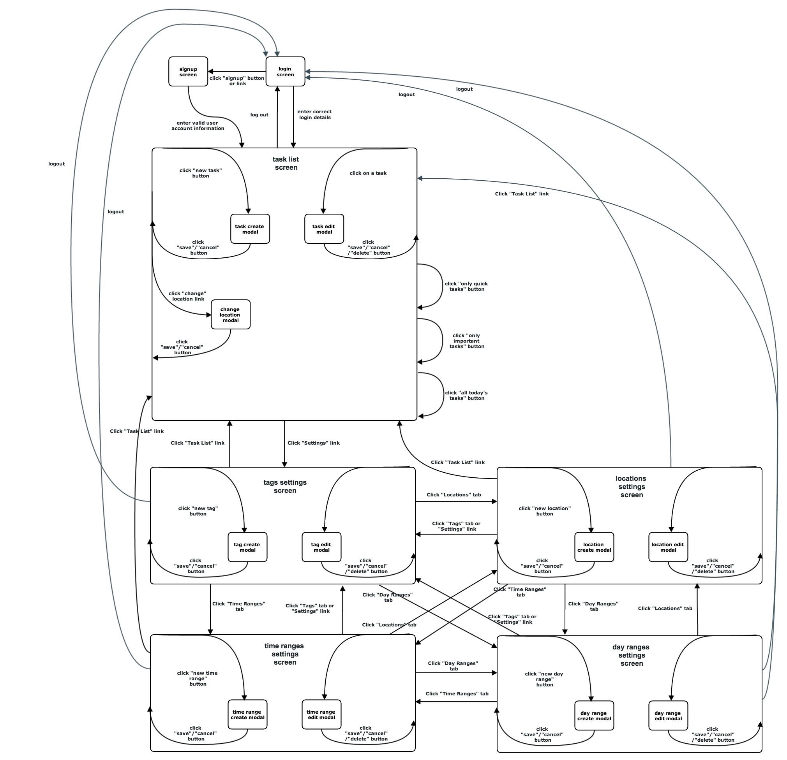

#### Page Wireframes

##### Log In Page
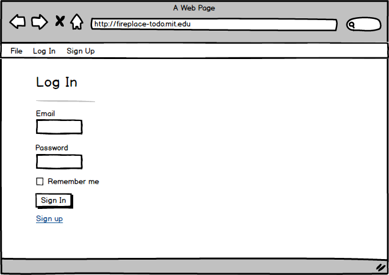

##### Sign Up Page
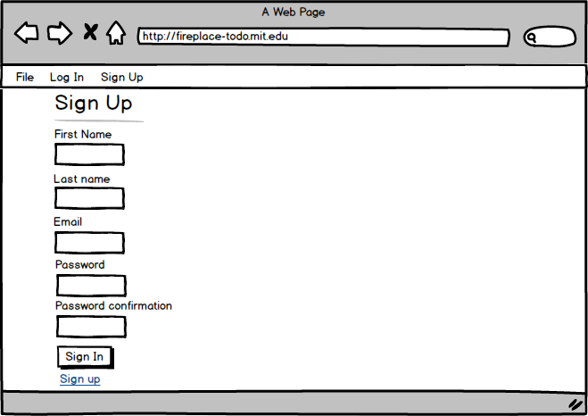

##### Home Page

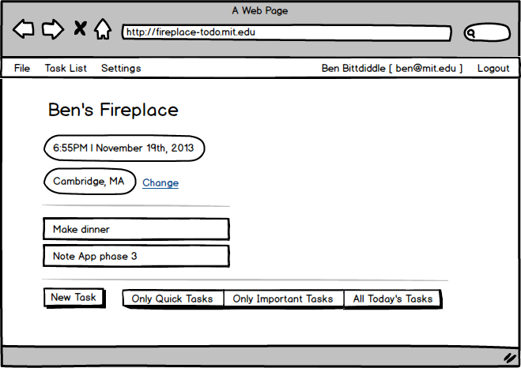

##### Change Location Modal

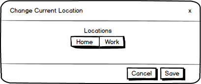

##### New Task Modal

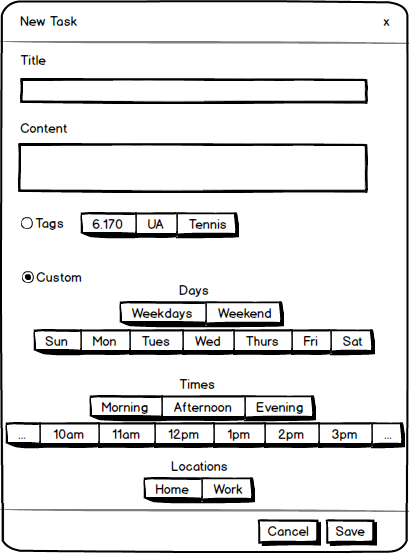

##### Edit Task Modal

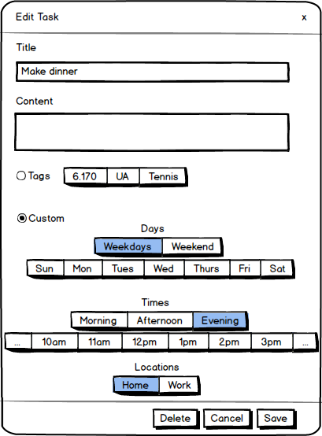

##### User Settings - Tags Page

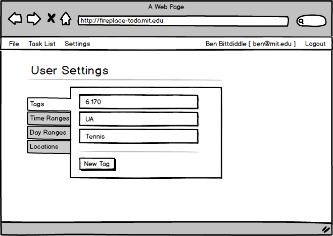

##### New Tag Modal

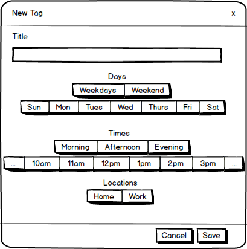

##### Edit Tag Modal

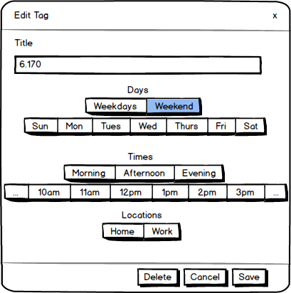

##### User Settings - Time Ranges Page

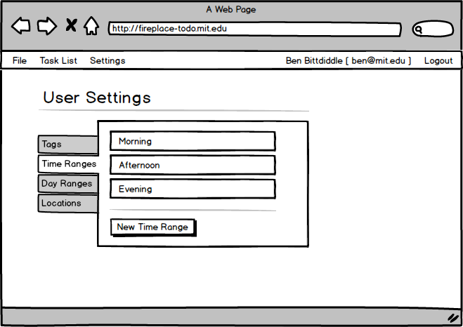

##### New Time Range Modal

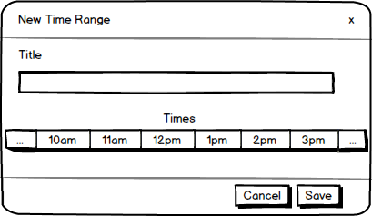

##### Edit Time Range Modal

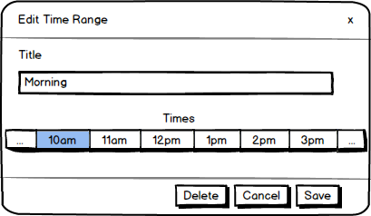

##### User Settings - Day Ranges Page

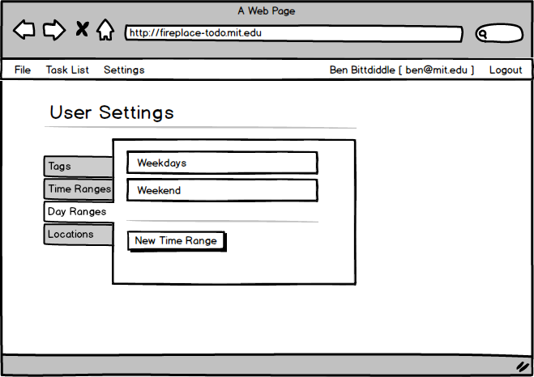

##### New Day Range Modal

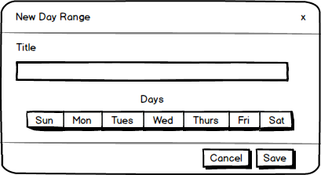

##### Edit Day Range Modal

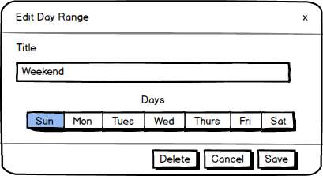

##### User Settings - Locations Page

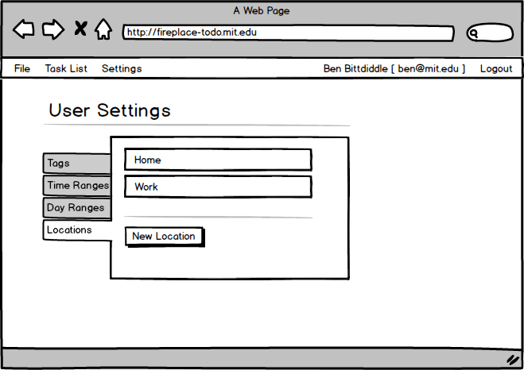

##### New Location Modal

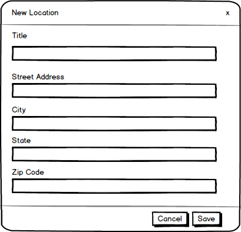

##### Edit Location Modal

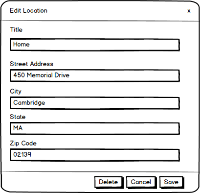

Challenges
---------------

### Design Challenges 

#### Behavior

+ Number of Tags per Task - How should the user be encouraged to think of tags?
	+ Allow At Most 1 Tag per Task
	Pushes the idea that Tags are disjoint categories into which a Task can be classified
		+ Pro: shortens process of choosing Tags upon Task creation since once a user chooses 1 Tag, they are done
		+ Con: means that if a user wants multiple tags to apply to a Task, they must first create a composite Tag, then apply that Tag to the Task in question
	+ **Allow Multiple Tags per Task**
	Pushes the idea that Tags are like Piazza tags or Twitter hashtags (hence calling them “Tags”)  
		+ Pro: more user control when creating Tasks
		+ Con: possibility of complicating the Task creation process and determining when the task is relevant
	+ Proposed Solution: Allow Multiple Tags per Task

+ Overriding Automatic Hiding of Tasks - How should the user be able to ensure they do not miss relevant Tasks?
	+ Include Randomness In Display Condition
		+ Pro or Con: any Task theoretically could be shown at any time
		+ Con: does not guarantee problem is solved, since app could get extremely unlucky and still hide things the user wants
	+ **“See All Tasks” and “See Today’s Tasks” and other buttons**
		+ Pro: “See All Tasks” provides a blanket solution, solves all problems regarding hiding too much
		+ Pro: “See Today’s Tasks” allows incremental stages in between fully automatic filtering and seeing everything, ignoring time and location
		+ Pro: could extend to “See Tomorrow’s Tasks” and “See Week’s Tasks”
		+ Con: if used too often, defeats purpose of Fireplace
	+ Proposed Solution: “See All Tasks” and “See Today’s Tasks” and other buttons

+ Non-periodic Conditions - What about Tasks whose relevance depends not only on day of the week and time of day but also on something non-periodic, like a due date?
	+ **Allow Due Date Input**
		+ Pro: grants user commonly desired feature of hiding Tasks that are not due in the near future
		+ Con: more input means more work for user
		+ Con: user would also need to specify how long before the due date they want to start seeing the Task
	+ Only Allow Day of Week, Time of Day, Location
		+ Pro: do not have to worry about details of due dates
		+ Con: ignores popular trend that users value a Task more highly (the Task become more relevant) as the due date approaches
	+ Proposed Solution: Allow Due Date Input

+ Nested Tags - Should we allow the user to nest tags?
	+ Yes, Allow Nesting Tags
		+ Pro: could be unique, interesting, and with some work, more efficient for task creation
		+ Con: probably extra work for User to make worth it, might not even pay off
		+ Con: introduces possibility of loops and such into Tag inheritance idea
	+ **No, Do Not Allow Nesting Tags**
		+ Pro: again, a simpler user experience
		+ Pro: one layer seems like it is usually enough to describe necessary relevance metadata
		+ Con: if it turns out that one layer is not be enough, extra Tags must be made, hindering efficiency and simplicity
	+ Proposed Solution: No, Do Not Allow Nesting Tags

+ Premade Time/Day Ranges vs. Specific Times/Days - Should we allow the user to include both individual days/times AND day-ranges/time-ranges when creating a task, or choose one or the other?
	+ **User Chooses One**
		+ Pro: simplifies the user experience instead of overlapping concepts
		+ Pro: easier to (implicitly or explicitly) explain to the User how input form works
		+ Con: limits user freedom slightly
		+ Con: could cause Users to create unnecessary Tags, Time Ranges, or Day Ranges
	+ Allow Both Inputs At Once
		+ Pro: grants slightly more user freedom
		+ Con: overlaps concepts, possibly unsettling for User as the mental model is more difficult
		+ Con: User may not understand how the input form works
	+ Proposed Solution: User chooses one
	
#### Code

+ Storing time ranges in the database
    + Only store start and end times
        + Pro: requires little storage space
        + Con: calculating time range intersections is tricky
    + **Store List of Predefined Time Ranges (e.g. hours)**
        + Pro: time range intersection is simple
        + Con: limited time resolution; 
    + Proposed Solution: Store list of predefined time ranges
+ Storing set of days/times in the database
    + Store array and add methods for manipulating the array (adding times/removing times)
        + Pro: simpler database schema
        + Con: don't get abstract data types to work with
    + **Store serialized set of abstract data types**
        + Pro: always pass around objects; easy to work with
        + Con: need to serialize
    + Proposed Solution: Store serialized set
+ When to create modals for editing tasks/tags/...
    + **At index page load**
        + Pro: modals appear instantly when user requests them
        + Con: need to create a lot of modals; slows down page load
    + On AJAX return from controller edit method
        + Pro: modals only created when needed; modal content won't get stale
        + Con: user may get confused why modals don't open immediately
    + Proposed Solution: At index page load
